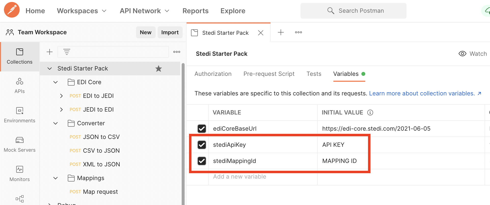

# Stedi Postman collection

Welcome to Stedi Postman Collection guide - a quick and easy way to send API requests without code. In this repository, you will find examples and templates showing how to use [Stedi APIs](https://www.stedi.com/docs) using Postman.

## First things first  

To begin, [create a free Stedi account](https://terminal.stedi.com/sign-up) and create a [Stedi API Key](https://www.stedi.com/docs/authentication). 

Next, import the Postman collection to your workspace using the button below.

[](https://god.postman.co/run-collection/0bca9666a7bb162b59b2?action=collection%2Fimport)


## API key configuration
Once the collection has been imported into Postman, we need to configure a Stedi API key. 

Configure the Postman environment variable `stediApiKey` with your API key. You can configure this setting under the `Environment Variables` tab on the left hand side. 



You can now send requests to Stedi by pressing "send request". 

For more details, please review our API documentation [on Documenter](https://documenter.getpostman.com/view/17436649/UVJbGHLL).

## How to format EDI files for Postman calls 

Raw EDI files contain multiple whitespaces at the end of each line. We need to remove these newline characters (`\n`) before sending them in an API request to Stedi.

There are two ways to do this manually:

1. You can use a Bash command to remove the newline characters directly from a file. 
2. If you are uncomfortable using Bash, you can use a text or code editor to remove the newline characters.


### Removing newlines from EDI files using a Bash command

The following one line command will remove all newline characters from the `edifile.txt` file and store the results in a new file called `edifile-no-newline.txt`:


```bash
tr -d '\n' < edifile.txt > edifile-no-newline.txt
```

### Removing newlines from EDI files using a text editor


