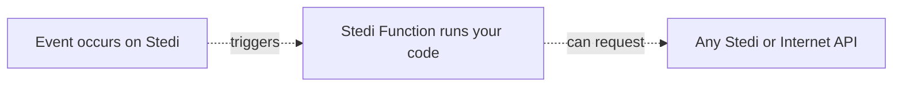

# Starter Kit - Functions

In this repository, you will find tutorials and examples to help you get started with Stedi Functions. Functions are the first generally available service on the Stedi Cloud platform, which will allow you build end to end business integrations. 

# About Functions

Stedi Functions lets you develop and run JavaScript or TypeScript code on the Stedi Cloud platform. Functions are always triggered by an event happening on the Stedi platform, such as an API call. 

Once the Function is started through a trigger, it executes your code and shuts down immediatly afterwards. Functions can run anywhere between 1 milisecond and 29 seconds and you are only charged for the duration of the execution. 

Today, Functions can respond to requests coming from the Stedi API or Stedi Terminal.  We plan to add additional inputs for event triggers in the future. Your Function can make any request to a Stedi or any external API.

# Tutorials

We include two basic examples to get you started;

## 1. Hello world (basic)

If you never used event driven functions before, we encourage you to take a look at our [hello world tutorial](https://github.com/Stedi/starter-kit/tree/function-samples/stedi-cloud/functions/hello-world). This code will teach you the basics to start writing your own functions. You can complete the tutorial using just the Stedi Terminal in your webbrowser. 

## 2. Web request function (advanced)

If you are more familiar with event driven services (such as AWS Lambda, Azure Functions or Google Cloud Functions), we encourage you to take a look at the [web request tutorial](https://github.com/Stedi/starter-kit/tree/function-samples/stedi-cloud/functions/web-request). Using this sample, you can make an outbound web request from your function, i.e. to an external webhook or API. 

This function does need to be deployed using a Bash script in order to package and bundle the code. We expect to have the Stedi CLI, Stedi SDK and Stedi Formation support in the coming weeks). 

