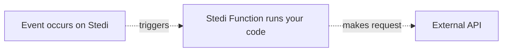

# Web Request Function

Welcome to the 'web request' tutorial of Stedi Functions. In this guide, we will deploy a Function packaged with your own libraries to make an external web request. 

* Level: Advanced
* Duration: 30 minutes
* Language: TypeScript

Here is a high level picture of how the components we will use in this guide fit together:



We will create a new Stedi Function which will contain all neccesary libraries to make an external web request (i.e. to make an API call). At the end, we can trigger this Function using the API or through Stedi Terminal to execute. The reply from the API will be returned through the request and logged in the Stedi Function logs.

Before we begin, we encourage to take a quick look at our ["hello world" tutorial](https://github.com/Stedi/starter-kit/tree/function-samples/stedi-cloud/functions/hello-world). We build on the same concepts that were explained there in this guide. One big difference is that we will also use your local CLI to run a few commands to build and package our function. 


## Required local tools 

In order to get started, you need need a Stedi account and be logged in to our Terminal; https://terminal.stedi.com/

In addition, ensure you have the following tools available on your machine:

- git (https://git-scm.com/downloads)
- npx (https://npx.dev)
- npm (https://www.npmjs.com/get-npm)
- curl (https://curl.haxx.se/docs/manpage.html)
- jq (https://stedolan.github.io/jq/)
- openssl (https://www.openssl.org/docs/man1.1.0/apps/openssl.html)

If you are using a Mac, you can easily install these tools using the Homebrew package manager. 

``` brew install git npx npm curl jq openssl ```

On Windows, you could use the Chocolatey package manager to do the same. 


## About Stedi Function development

We offer two methods to create Stedi Functions:

- **Inline code editing**, where you can edit your code directly in the Stedi Terminal. This is the easiest way to edit Functions, but it does not support bundling libraries or larger sections of code. We cannot use it for the purpose of this tutorial.

- **ZIP based code editting**, where you bundle an archive with your code and upload it to Stedi through our API. You can bundle up to 5MB of code this way and include any libraries or SDK's that you need for your Function. You do need to bundle and upload this code using the CLI, editting the Function through Terminal is not possible this way. 

We will use the ZIP based method using a Bash script included in this repository.

### Step 1: Create a new Function in Stedi Terminal

With that in mind, please go ahead and create a new Stedi Function in Terminal and name it `WebRequest`. After creation the Function will contain a standard, inline code example (the same one as in the "hello world" tutorial we looked at earlier). 

### Step 2: Clone this repository and configure deploy script

In order to make an outbound web request, we should include the Axios library in the ZIP file we will create. Axios is a popular HTTP client that makes it easy to make HTTP requests and makes it easier to make web requests. 

For the next steps, you will need to access your local (Bash) terminal. First off, clone our GitHub repository to a folder your local machine and go to the 'stedi-cloud/functions/web-request' folder.

```console
$ git clone https://github.com/Stedi/starter-kit.git
$ cd starter-kit/stedi-cloud/functions/web-request
```

Now you should see the following files in the local folder:

```console
.
├── deploy.sh   
├── event.json
├── index.ts       
└── package.json   
```

Let's explain what the purpose of these files is;

`deploy.sh` is a helper script to deploy ZIP based Functions from your local (Bash) terminal a bit easier. We intend to have a full SDK and CLI tools for this in the future and we will update this guide once those are available. 

 You can use it to perform CRUDL operations on your Functions to see or modify their configuration and code. In addition, you can also invoke Functions and read their logs through this method. 
 
 The deploy script has the following options available:

```console
    Usage:
    
        ./deploy.sh [OPTION]

    Options:

        build                Build package for ZIP deploy
        delete               Delete an existing Function
        create               Create a new Function
        update               Update an existing Function
        read                 Describe Function
        list                 List all Functions in your account
        logs                 View all logs for a Function
        logs <log-id>        Get a specific log for a Function 
        invoke               Invoke function with the './events.json' payload

    Examples:

        ./deploy.sh create
        ./deploy.sh update

        ./deploy.sh invoke 
        ./deploy.sh logs a834a72d-685c-439f-a7a3-6e1187d99b66

```

Let's go ahead and open the `deploy.sh` file in a text editor. There are two things we need to pay attention to in this file:

- On line 4, ensure that your valid Stedi API key is entered. You can create a new Stedi API key here; https://terminal.stedi.com/apikeys

- On line 5, make sure that the function name is "webrequest" (or whatever name you gave the Function just created, as long as they are the same).

Save the file and return to your Bash terminal. 

You can test if they can succesfully see and describe your function. Try running a "describe" command - it should return something like this if the API key is correctly set:

```console
$ bash deploy.sh describe
```
```bash
describe function webrequest

{
  "code": "exports.handler = async function (event, context) {\n  console.log(\"EVENT: \" + JSON.stringify(event));\n  return { event };\n};",
  "created_at": "2022-04-13T22:05:50.157Z",
  "environment_variables": {},
  "function_name": "webrequest",
  "log_group_name": "/aws/lambda/webrequest",
  "log_retention": "one_day",
  "updated_at": "2022-04-13T22:05:50.157Z"
}
```

You can see a few interesting properties in the API response. First off, we can see that the Function is using the default `code` that's included upon creation. We can also see details about when the function was created and last updated. Finally, information about log retention and the log group name are displayed. 

### Step 4: Build and deploy the Function

Since we do want to make an outbound web request with the Function, we should take a look at it in the `handler.ts` code. In here, we make a simple HTTP GET request using Axios to Wikipedia in order to retrieve some HTML content. You can take a look at the Function's code to get a better understanding of it, but you do not need to modify anything.

Finally, we have the `package.json` file. This is a standard NodeJS package file with the right dependancies preconfigured. You do not need to edit this file, but you can take a look to see how the libraries are included. 

<screenshot-code>

The code is only locally present on our machine, so we need to deploy it to Stedi Cloud. We can do this by running an "update" command. 

```console
$ bash deploy.sh update
```

The response should look as follows:

```bash
starting build

  adding: index.js (deflated 78%)

built package for webrequest, ready to deploy


{
  "created_at": "2022-04-13T22:05:50.157Z",
  "environment_variables": {},
  "function_name": "webrequest",
  "log_group_name": "/aws/lambda/webrequest",
  "log_retention": "one_day",
  "updated_at": "2022-04-13T22:16:36.768Z"
}
completed PUT for webrequest function
```

The Function should now be succesfully updated on Stedi Cloud and we can try to invoke it. 

In order to invoke a Function, we need to submit a payload to the Function through the local `event.json` document. By default, it has the following topic set:

```json
{
    "topic": "Electronic_data_interchange"
}

```

We can invoke the Function with this payload by running the following command:

```console
$ bash deploy.sh invoke
```

The CLI response should look as follows:

```bash
invoke function webrequest

{
  "statusCode": 200,
  "headers": {
    "Content-Type": "application/json"
  },
  "body": "<some long text>"
}
```

We can also invoke the Function through Stedi Terminal, but in most cases it's easier to programatically invoke it using our API. 


## Tips and tricks for development

You might be wondering now - how can I use Stedi Functions to solve my usecases? We wanted to provide a few helpful tips to get you in the right direction. 

### Creating, updating and deleting Functions

Since it's likely you will need to include some libraries in your Functions, we generally recommend to use the deploy script or the Stedi API to develop. You could create a new Function using `bash deploy.sh create`, which will create a new Function on Stedi and push your local code to it. After that, you can use the `bash deploy.sh update` command to push incremental updates to your code. 

### Reading Function logs

You can also use the script or our API to read logs from your Functions. These logs are automatically captured whenever your Function is invoked and can help you to find and debug any issues with your code. You can view all logs for a function using `bash deploy.sh logs`. This will return a list of executions as follows:

```console
$ bash deploy logs
```
```bash
view logs for webrequest

{
  "items": [
    {
      "created_at": "2022-04-14T17:11:29.212Z",
      "function_execution_id": "6c253bb0-8382-4882-8e4d-60708675612e"
    },
    {
      "created_at": "2022-04-13T22:33:56.220Z",
      "function_execution_id": "fc063c1f-4141-4ec9-a4cf-412e6d6956ed"
    }
  ]
}
```

### Conclusion

This concludes our webrequest tutorial on Functions. We hope you enjoyed the experience and will build great solutions with Stedi Cloud! For questions, reach out to us [here](https://www.stedi.com/contact). 
